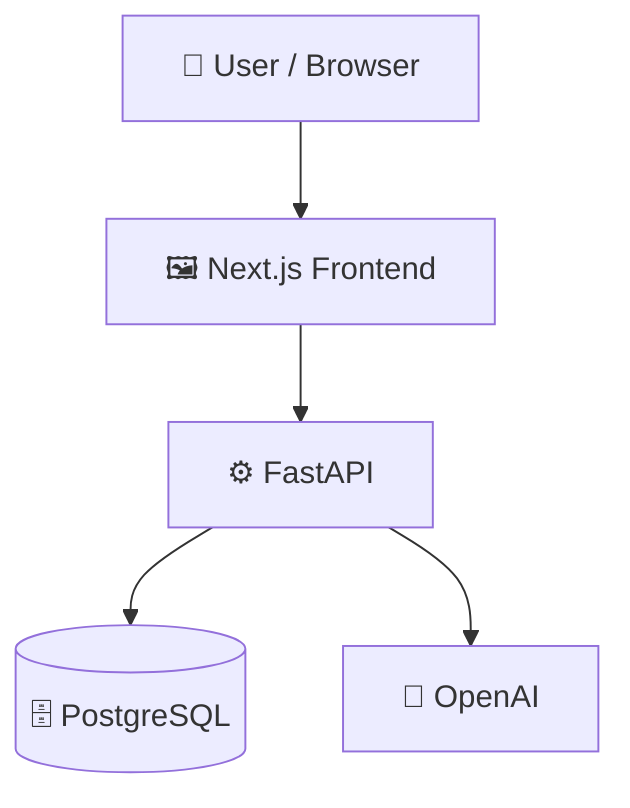

# smart-recruitment-System

> An AI-powered recruitment platform with automated screening, proctoring, and offer generation.

         

## 📑 Table of Contents

- [Description](#description)
- [Key Features](#key-features)
- [Use Cases](#use-cases)
- [Screenshots](#screenshots)
- [Tech Stack](#tech-stack)
- [Architecture](#architecture)
- [Quick Start](#quick-start)
- [Key Dependencies](#key-dependencies)
- [Available Scripts](#available-scripts)
- [Project Structure](#project-structure)
- [Development Setup](#development-setup)
- [Contributors](#contributors)
- [Contributing](#contributing)

## 📝 Description

The Smart Recruitment System is a full-stack web application designed to streamline the hiring workflow from initial candidate applications to official offer generation. It solves the operational challenge of processing large volumes of applicants by consolidating resume screening, technical assessments, and interviewer scheduling into a single unified workspace.

## ✨ Key Features

- **📄 AI-Driven Resume Matching** — Extracts text from uploaded candidate resumes to calculate compatibility match scores against job descriptions.
- **👁️ Automated Exam Proctoring** — Analyzes visual frames during online aptitude tests and logs cheating metrics to assist with automated candidate rejection.
- **✉️ Document and Email Automation** — Triggers candidate communication emails and generates official offer letters upon successful hiring decisions.
- **🔒 Secure Candidate Authentication** — Handles registration, login credentials, and session access tokens through a secure FastAPI authentication workflow.
- **🎨 Modern Frontend Experience** — Uses Next.js, Framer Motion, and Radix UI to deliver an immersive, responsive, dark-mode user interface.

## 🎯 Use Cases

- Administering remote pre-employment aptitude tests with active proctoring to prevent candidate cheating.
- Automating the resume screening process for high-volume recruitment drives using AI match scoring.
- Coordinating interview availability and programmatically generating offer letters for successful hires.

## 📸 Screenshots


## 🛠️ Tech Stack

- ⚡ **FastAPI**
- ▲ **Next.js**
- 🐘 **PostgreSQL**
- 🐍 **Python**
- 🌬️ **Tailwind CSS**
- 📘 **TypeScript**

**Notable libraries:** Framer Motion, OpenAI, Radix UI, SQLAlchemy, Uvicorn

## 🏗️ Architecture

A high-level view of how the main pieces fit together:



## ⚡ Quick Start

```bash

# 1. Clone the repository
git clone https://github.com/HetasviVaghani/smart-recruitment-System/.git

# 2. Install dependencies
npm install

# 3. Start the dev server
npm run dev
```

## 📦 Key Dependencies

```
@radix-ui/react-alert-dialog: ^1.1.15
@radix-ui/react-label: ^2.1.8
@radix-ui/react-separator: ^1.1.8
@radix-ui/react-slot: ^1.2.4
@vercel/analytics: ^2.0.1
axios: ^1.15.0
class-variance-authority: ^0.7.1
clsx: ^2.1.1
framer-motion: ^12.38.0
lucide-react: ^0.577.0
next: ^16.2.3
next-themes: ^0.4.6
react: 19.2.4
react-dom: 19.2.4
react-parallax-tilt: ^1.7.322
```

## 🚀 Available Scripts

- **dev** — `npm run dev`
- **build** — `npm run build`
- **start** — `npm run start`
- **lint** — `npm run lint`

## 📁 Project Structure

```
.
├── ai-recruitment-frontend
│   ├── AGENTS.md
│   ├── CLAUDE.md
│   ├── app
│   │   ├── candidate
│   │   │   ├── applications
│   │   │   │   └── page.tsx
│   │   │   ├── exam
│   │   │   │   └── page.tsx
│   │   │   ├── interview
│   │   │   │   └── page.tsx
│   │   │   ├── jobs
│   │   │   │   └── page.tsx
│   │   │   ├── layout.tsx
│   │   │   ├── offer
│   │   │   │   └── page.tsx
│   │   │   ├── page.tsx
│   │   │   └── upload
│   │   │       └── page.tsx
│   │   ├── dashboard
│   │   │   ├── admin
│   │   │   │   ├── AdminDashboard.tsx
│   │   │   │   ├── applicants
│   │   │   │   │   └── ...
│   │   │   │   ├── companies
│   │   │   │   │   └── ...
│   │   │   │   ├── create-recruiter
│   │   │   │   │   └── ...
│   │   │   │   └── jobs
│   │   │   │       └── ...
│   │   │   ├── layout.tsx
│   │   │   ├── page.tsx
│   │   │   └── recruiter
│   │   │       ├── RecruiterDashboard.tsx
│   │   │       ├── Schedule-interview
│   │   │       │   └── ...
│   │   │       ├── applicants
│   │   │       │   └── ...
│   │   │       ├── cheating-dashboard
│   │   │       │   └── ...
│   │   │       ├── company
│   │   │       │   └── ...
│   │   │       ├── exam
│   │   │       │   └── ...
│   │   │       ├── exam-dashboard
│   │   │       │   └── ...
│   │   │       ├── jobs
│   │   │       │   └── ...
│   │   │       ├── post-job
│   │   │       │   └── ...
│   │   │       └── ranking
│   │   │           └── ...
│   │   ├── favicon.ico
│   │   ├── globals.css
│   │   ├── layout.tsx
│   │   ├── page.tsx
│   │   └── register
│   │       └── page.tsx
│   ├── components
│   │   ├── CompanySetupInline.tsx
│   │   ├── candidate
│   │   │   ├── Charts.tsx
│   │   │   ├── Header.tsx
│   │   │   ├── JobCard.tsx
│   │   │   ├── Sidebar.tsx
│   │   │   └── StatsCard.tsx
│   │   ├── loader.tsx
│   │   └── ui
│   │       ├── NeuralBackground.tsx
│   │       ├── button.tsx
│   │       ├── card.tsx
│   │       ├── input.tsx
│   │       └── label.tsx
│   ├── eslint.config.mjs
│   ├── hooks
│   │   └── useAuth.ts
│   ├── lib
│   │   ├── api.ts
│   │   └── utils.tsx
│   ├── middleware.ts
│   ├── next-env.d.ts
│   ├── next.config.ts
│   ├── package.json
│   ├── postcss.config.mjs
│   ├── public
│   │   ├── file.svg
│   │   ├── globe.svg
│   │   ├── images
│   │   │   ├── hero-bg.jpg
│   │   │   └── pattern-bg.jpg
│   │   ├── next.svg
│   │   ├── vercel.svg
│   │   └── window.svg
│   ├── services
│   │   └── jobService.ts
│   ├── tailwind.config.js
│   └── tsconfig.json
├── backend
│   ├── __init__.py
│   ├── admin.py
│   ├── ai_exam.py
│   ├── ai_matching.py
│   ├── ai_proctoring.py
│   ├── auth.py
│   ├── cheating_engine.py
│   ├── create_admin.py
│   ├── database.py
│   ├── email_service.py
│   ├── main.py
│   ├── models.py
│   ├── offer_letter.py
│   └── resume_parser.py
├── offer_letters
│   └── Hetasvi Vaghani_offer_letter.pdf
└── requirements.txt
```

## 🛠️ Development Setup

### Node.js / JavaScript
1. Install Node.js (v18+ recommended)
2. Install dependencies: `npm install` (or `yarn` / `pnpm install` / `bun install`)
3. Start the dev server: see the **Quick Start** above

### Python
1. Install Python (v3.10+ recommended)
2. `python -m venv venv && source venv/bin/activate`  (Windows: `venv\Scripts\activate`)
3. `pip install -r requirements.txt`

## 👥 Contributors

Thanks to everyone who has contributed to this project:

<p align="left">
<a href="https://github.com/HetasviVaghani" title="HetasviVaghani"></a>
</p>

[See the full list of contributors →](https://github.com/HetasviVaghani/smart-recruitment-System/graphs/contributors)

## 👥 Contributing

Contributions are welcome! Here's the standard flow:

1. **Fork** the repository
2. **Clone** your fork: `git clone https://github.com/HetasviVaghani/smart-recruitment-System/.git`
3. **Branch**: `git checkout -b feature/your-feature`
4. **Commit**: `git commit -m 'feat: add some feature'`
5. **Push**: `git push origin feature/your-feature`
6. **Open** a pull request

Please follow the existing code style and include tests for new behavior where applicable.

---
*This README was generated with ❤️ by [ReadmeBuddy](https://readmebuddy.com)*
